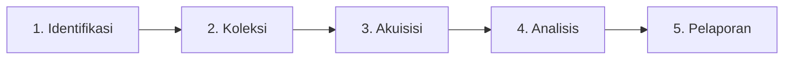

# Materi Inti — Minggu 02

## 1. Ontologi dan Definisi Forensik Digital

### A. Etimologi dan Definisi Sains Forensik
- **Asal Kata**: Istilah *forensic* berakar dari bahasa Latin *forensis*, yang berarti "berkenaan dengan forum atau pasar umum (*marketplace*)". Pada era Romawi kuno, *forum* adalah tempat perdebatan publik dan proses pengadilan perkara hukum.
- **Forensic Science (Sains Forensik)**:
  - Definisi Merriam-Webster: Penerapan pengetahuan ilmiah untuk menyelesaikan permasalahan hukum (*legal problems*).
  - Definisi NIST: Penggunaan metode atau keahlian ilmiah untuk menginvestigasi kejahatan atau meneliti bukti yang dapat diajukan di pengadilan hukum.
  - Definisi André Årnes (2017): *"The application of scientific methods to establish factual answers to legal problems."*

### B. Esensi "Digital" dan "Metode Ilmiah"
- **Entitas Digital**: Perangkat digital adalah sistem yang menyimpan, memproses, atau mentransmisikan informasi dalam representasi biner kombinasi bit $0$ dan $1$ (mencakup PC, server, smartphone, router, IoT, smart printer, vehicle ECUs).
- **Metode Ilmiah (*Scientific Method*)**:
  - Investigasi forensik digital bukanlah sekadar keahlian mengoperasikan perangkat lunak, melainkan penerapan metode ilmiah terstruktur:
    $$\text{Pengenalan Masalah} \longrightarrow \text{Pengumpulan Data (Observasi)} \longrightarrow \text{Formulasi Hipotesis} \longrightarrow \text{Pengujian Hipotesis Eksperimental}$$
  - Forensik digital menggunakan metode ilmiah sebagai pedoman untuk **menemukan fakta** dan **menganalisis korelasi informasi secara objektif**.

---

## 2. Bukti Digital dalam Perspektif Yuridis dan Akademik

### A. Spektrum Definisi Bukti Digital (*Digital Evidence*)
- **Eoghan Casey (2000)**: Semua data digital yang dapat membuktikan bahwa tindak pidana telah terjadi, atau dapat menyediakan keterkaitan antara kejahatan dengan korban atau pelakunya.
- **SWGDE**: Setiap informasi yang bernilai pembuktian (*probative value*) yang disimpan atau ditransmisikan dalam bentuk biner digital.
- **ACPO & Brian Carrier (2006)**: Data digital yang mendukung atau menyanggah (*support or refute*) suatu hipotesis mengenai peristiwa digital (*digital events*) atau keadaan data digital.

### B. Kedudukan Yuridis di Indonesia (KUHAP, UU ITE, Putusan MK)
Dalam sistem hukum pidana Indonesia, terdapat distingsi tegas antara **Barang Bukti** dan **Alat Bukti**:

1. **Barang Bukti (Objek Sitaan — Pasal 39 ayat 1 KUHAP)**:
   - Benda atau tagihan yang seluruh/sebagian diduga diperoleh dari tindak pidana atau sebagai hasil kejahatan;
   - Benda yang dipergunakan langsung untuk melakukan tindak pidana atau mempersiapkannya (laptop pelaku, flash disk);
   - Benda yang digunakan untuk merintangi penyidikan;
   - Benda yang dibuat khusus untuk tindak pidana (malware tool, hardware skimmer);
   - Benda lain yang memiliki hubungan langsung dengan tindak pidana.
2. **Alat Bukti yang Sah (Pasal 184 ayat 1 KUHAP)**:
   - Terbatas secara limitatif pada: (1) Keterangan Saksi, (2) Keterangan Ahli, (3) Surat, (4) Petunjuk, dan (5) Keterangan Terdakwa.
3. **Perluasan Alat Bukti Elektronik (UU ITE & Putusan MK No. 20/PUU-XIV/2016)**:
   - Berdasarkan Pasal 5 ayat (1) dan (2) UU ITE, informasi elektronik dan/atau dokumen elektronik serta hasil cetaknya merupakan perluasan alat bukti hukum yang sah.
   - **Kaidah Putusan MK 20/2016**: Bukti rekaman/informasi elektronik baru memiliki kekuatan pembuktian yang sah secara hukum **apabila diperoleh dalam rangka penegakan hukum atas permintaan resmi kepolisian, kejaksaan, atau institusi penegak hukum lainnya (*Lawful Interception/Acquisition*)**. Bukti elektronik yang diperoleh secara melawan hukum (*unlawful/fruit of the poisonous tree*) gugur sebagai alat bukti yang sah.

---

## 3. Standar Kelayakan Bukti Ilmiah di Pengadilan (*Admissibility*)

Agar analisis forensik diakui oleh hakim di pengadilan, metodologi yang digunakan harus lolos uji kelayakan ilmiah:

### A. Frye Standard (*Frye v. United States*, 1923)
- Menetapkan aturan **"Penerimaan Umum" (*General Acceptance Test*)**.
- Bukti ilmiah hanya dapat diterima apabila metodologi atau instrumen yang digunakan telah diakui dan diterima secara luas oleh komunitas ilmiah di bidang yang relevan. Kelemahannya: menutup pintu bagi metode inovatif baru yang valid tapi belum sempat mapan.

### B. Daubert Standard (*Daubert v. Merrell Dow Pharmaceuticals*, 1993)
- Memberikan peran kepada hakim sebagai **penjaga gerbang (*gatekeeper*)** untuk menilai keandalan metodologi ilmiah (*evidentiary reliability*) dengan 4 kriteria pengujian:
  1. **Empirical Testing**: Apakah teknik atau metodologi tersebut dapat diuji dan sudah pernah diuji secara empiris?
  2. **Peer Review & Publication**: Apakah metode tersebut telah dipublikasikan dalam literatur ilmiah yang ditelaah sejawat (*peer-reviewed*)?
  3. **Known or Potential Error Rate**: Apakah tingkat kesalahan (*error rate*) dari teknik atau instrumen tersebut terukur dan dapat diketahui batas toleransinya?
  4. **General Acceptance**: Apakah metode tersebut telah diterima secara luas oleh komunitas ilmiah forensik?

---

## 4. Taksonomi dan Evolusi Framework Forensik Digital (1995–2017)

Investigasi forensik memerlukan model proses terstruktur agar terjamin bersifat *forensically sound* (McKemmish 2008). Perkembangan framework investigasi mencerminkan evolusi platform komputasi:

| Era / Tahun | Model / Framework | Pelopor / Standar | Domain Utama |
| :--- | :--- | :--- | :--- |
| **1995** | Computer Forensics Process | Mark Pollitt | Komputer |
| **1999** | Four Key Elements of Forensic Computing | McKemmish (Identification, Preservation, Analysis, Presentation) | Komputer, Jaringan, Mobile |
| **2001** | Electronic Crime Scene Investigation | NIJ (National Institute of Justice) | Komputer, Jaringan, Mobile |
| **2001** | Framework DFRWS First Consensus | Palmer / DFRWS Consensus | Komputer, Jaringan |
| **2002** | Abstract Digital Forensics Model | Reith, Carr, & Gunsch | Komputer, Jaringan, Mobile, Cloud |
| **2003** | Integrated Digital Investigation Process (IDIP) | Brian Carrier & Eugene Spafford | Integrasi Fisik & Digital |
| **2006** | Forensic Process Model | Kent et al. (NIST SP 800-86) | Komputer, Jaringan, Mobile |
| **2012** | Integrated Conceptual Framework for Cloud | Martini & Choo | Cloud Computing Forensics |
| **2014** | Guidelines on Mobile Device Forensics | Ayers, Brothers, & Jansen (NIST SP 800-101) | Mobile Forensics |
| **2015** | Harmonized Digital Investigation Process | ISO/IEC 27043:2015 | Komputer, Jaringan, Mobile, Cloud |
| **2017** | Integrated Digital Forensics Investigation Framework | Ruuhwan & Prayudi | Komputer & Mobile |

### Model NIST SP 800-86: Empat Tahap Inti
1. **Collection**: Mengidentifikasi sumber data potensial, merencanakan akuisisi berdasarkan prioritas (*Likely Value*, *Volatility*, *Effort*), melakukan akuisisi, dan memverifikasi integritas hash.
2. **Examination**: Mengolah data mentah dengan alat forensik untuk mengekstraksi artefak tersembunyi/dihapus.
3. **Analysis**: Menghubungkan artefak dengan kasus untuk menarik kesimpulan logis.
4. **Reporting**: Menyusun dokumentasi tertulis hasil temuan untuk kepentingan persidangan.

---

## 5. Rincian Teknis 5 Tahap Proses Forensik Umum

### 1. Tahap Identifikasi
- Penentuan jenis tindak pidana dan profil tersangka/korban.
- Identifikasi perangkat fisik di TKP (pembuat, nomor seri, model, status daya, display screen).
- Aspek Legal: Kepemilikan surat perintah penyitaan dan penggeledahan (*search & seizure warrant*).
- Pemeliharaan **Chain of Custody (Rantai Penjagaan Bukti)**: Formulir formal yang melacak riwayat fisik bukti sejak ditemukan, siapa yang memegang, tanggal/jam serah terima, hingga alasan pemindahan.

### 2. Tahap Koleksi (*Securing the Evidence*)
- **Isolasi Sinyal Komunikasi**: Mematikan radio frekuensi menggunakan *Faraday Bag*, sangkar Faraday, atau mode pesawat terbang guna mencegah penghapusan data jarak jauh (*remote wipe*).
- Dokumentasi visual (fotografi 360 derajat TKP sebelum disentuh).
- Pelabelan fisik kabel, port, dan perangkat, pembungkusan anti-statis, dan pengepakan fisik untuk transportasi aman ke laboratorium.

### 3. Tahap Akuisisi (*Preserving & Duplicating*)
- **Tiga Teknik Akuisisi**:
  1. *Physical Acquisition*: Kloning bit-demi-bit seluruh sektor media penyimpanan fisik (termasuk *slack space* dan *unallocated space*).
  2. *File System Acquisition*: Ekstraksi seluruh struktur direktori dan file yang dikenali oleh sistem berkas.
  3. *Logical Acquisition*: Ekstraksi berkas dan folder tertentu yang dapat diakses oleh OS.
- **Manajemen Kopi Bukti (Aturan Tiga Salinan)**:
  - **Original Device**: Disimpan di lemari bukti (*evidence locker*) bersuhu stabil dan tidak disentuh lagi.
  - **Primary Copy (Salinan Utama)**: Hasil akuisisi bit-stream pertama yang disimpan sebagai *golden backup* terenkripsi untuk verifikasi masa depan.
  - **Secondary Copy (Salinan Kerja)**: Salinan yang dimuat ke dalam workstation analisis forensik untuk dieksplorasi secara aktif oleh investigator.

### 4. Tahap Analisis (*Examination & Analysis*)
- Memisahkan data relevan dari data non-relevan (*filtering & timeline analysis*).
- **Lima Aturan Pembuktian (*The 5 Rules of Evidence*)**:
  1. **Admissible**: Bukti harus dikumpulkan sesuai prosedur hukum agar dapat diterima hakim.
  2. **Authentic**: Bukti harus terbukti asli dan memiliki korelasi langsung dengan tersangka atau tempat kejadian perkara.
  3. **Complete**: Bukti tidak disajikan secara terpotong (*cherry-picked*), melainkan menyajikan narasi peristiwa secara utuh.
  4. **Reliable**: Instrumen dan teknik analisis tidak menimbulkan keraguan atas integritas bukti dan dapat diulang (*reproducible*).
  5. **Believable (Persuasive)**: Penjelasan ahli harus lugas, jelas, dan dapat dipahami secara meyakinkan oleh hakim serta orang awam.

### 5. Tahap Pelaporan (*Presentation / Reporting*)
- Penyusunan laporan teknis dan ringkasan eksekutif (*expert witness report*).
- Kewajiban netralitas ilmiah: Laporan wajib menyajikan fakta yang memberatkan tersangka (**inculpatory evidence**) sekaligus fakta yang berpotensi membebaskan/meringankan tersangka (**exculpatory evidence**).
